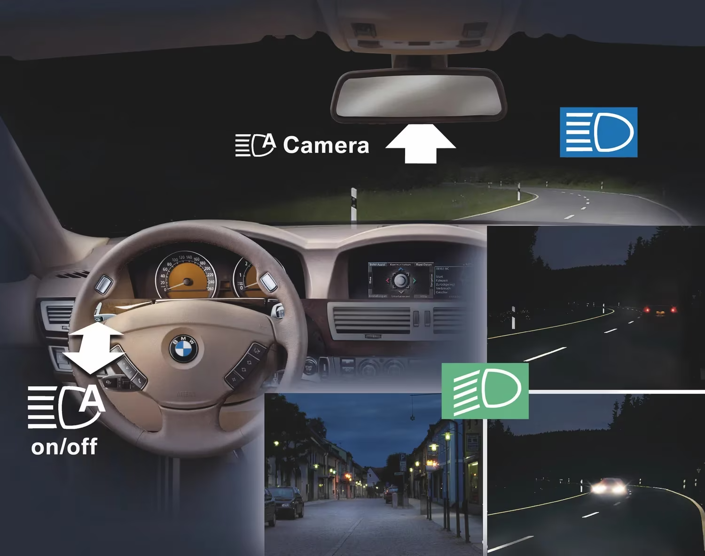

# Automatic High Beams Switching Model

## Overview

This model defines an **Automatic High Beams Switching System** that dynamically switches between high and low beams based on external inputs like:
- Ambient light levels
- Detected vehicles
- User toggling input

It is implemented using **state-based modeling** with clear separation of responsibilities, modular design, and built-in requirement validation.

---

## How It Works

The system operates similarly to the example shown below:

---

## Components and Responsibilities

### **1. ModeSelector**
- **Core Logic Controller**: Handles mode switching, state management, and system behavior.
- Tracks:
  - `module.state` (e.g., `Uninitialized`, `Operational`)
  - `mode` (e.g., `Manual`, `Automatic`)
- Relies on external components:
  - `FrontCamera`: Detects vehicles (`CarDetected`, `CarPassed`).
  - `LightSensor`: Detects ambient light levels (`LowLight`, `HighLight`).
  - `Timer`: Provides delay functionality for debounce and mode transitions.
  - `HighBeamsRelay`: Controls the high beams (`TurnOn`, `TurnOff`).
  - `Config`: Fetches system configurations (e.g., `timerDelayVal`).

---

## System Modes

### **1. Manual Mode**
- **User Input Priority**: High beams are toggled directly by the user.
- **Light Sensor Behavior**:
  - If `LowLight` is detected, a timer starts.
  - If `HighLight` or `CarDetected` occurs, the timer is canceled.
- **Mode Transition**:
  - On `lightsTimer.Timeout()`, the system transitions to `Automatic Mode` and turns on high beams.

### **2. Automatic Mode**
- **Sensor-Driven Control**:
  - High beams are turned **off** when:
    - Bright ambient light is detected.
    - A car is detected ahead.
  - High beams are turned **on** when:
    - The car ahead passes.
    - Ambient light levels drop.

---

## Timers and Logic

### **Timers in Manual Mode**
- If `LowLight` is detected:
  - A timer (`timerDelayVal`) is started to debounce the transition to automatic mode.
- If `HighLight` or a car is detected:
  - The timer is canceled.

### **Timers in Automatic Mode**
- Used for debounce and smooth transitions.
- Ensures high beams are toggled appropriately when conditions change.

---

## Requirements and Validation

### **Requirement 1**
- **High Beams Safety**:
  - In `Automatic Mode`, if a car is detected ahead, high beams must always be off.
  - Enforced using the `illegal` keyword, checked during formal verification.

---

## Termination Behavior
- On termination (`module.Terminate()`):
  - The system resets to `Manual Mode`.
  - Cancels all active timers.

---

## System Composition

### **AutoLightsSystem Component**
- Integrates all subcomponents:
  - `ModeSelector`: Core logic.
  - `FrontCamera`: Vehicle detection.
  - `TimerComponent`: Timing functionality.
  - `ConfigComponent`: System configuration.
- Handles external bindings for sensors, relays, and timers.

---

## Summary

This model provides a robust and modular implementation for automatic high beams switching with:
- Clear state-based transitions.
- Formal verification of requirements.
- Flexibility to handle user input and environmental changes.
